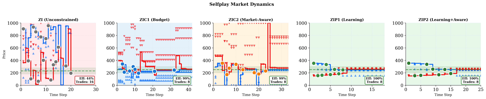
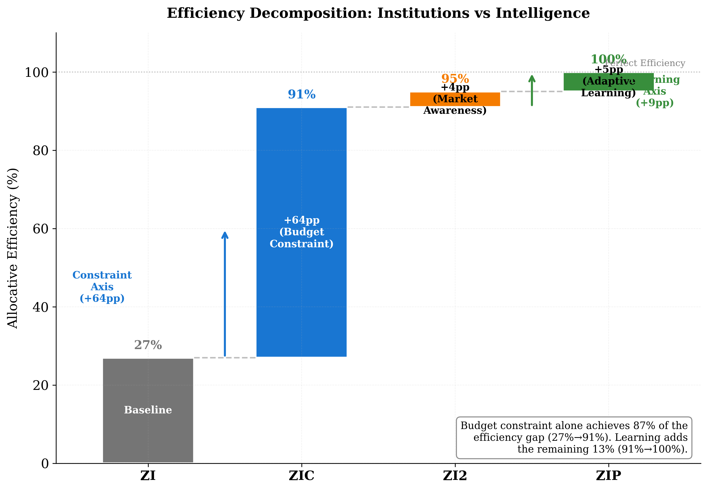
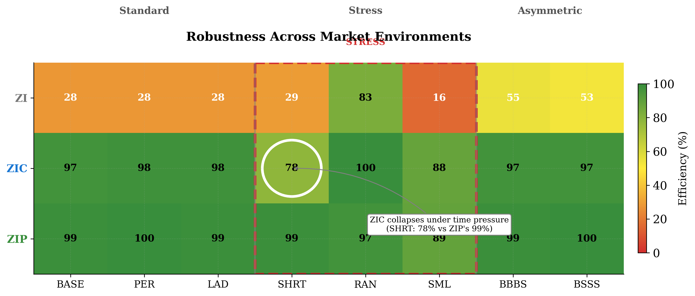
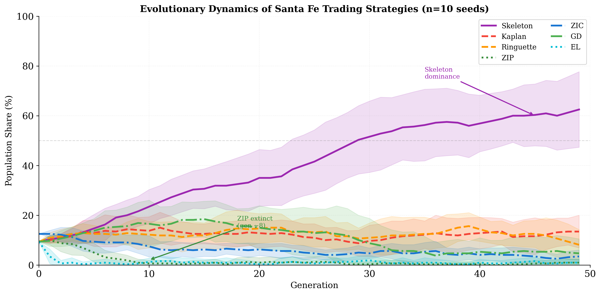

# Reinforcement Learning and Agentic Trading in Double Auctions

Replication and extension of the 1993 Santa Fe Double Auction Tournament with modern Deep Reinforcement Learning (PPO) and Large Language Model (GPT-4o) agents.

## Abstract

In 1993, the Santa Fe Institute hosted a seminal tournament where simple "sniping" heuristics outperformed complex trading algorithms in a continuous double auction. Thirty years later, we revisit this environment to investigate whether modern Deep Reinforcement Learning (PPO) and Large Language Models (GPT-4o) can solve the information aggregation problem without hard-coded rules. Our results show that: (1) PPO agents autonomously rediscover the "sniping" strategy, exploiting legacy heuristics; (2) Multi-agent PPO markets maintain high allocative efficiency, avoiding the market collapse observed in heuristic self-play; and (3) Zero-shot LLMs exhibit high efficiency but display distinct behavioral biases, prioritizing fairness over profit maximization.

## Market Dynamics

### Self-Play Dynamics

*Figure: Self-play dynamics across different trader populations showing convergence patterns and efficiency over time.*

### Efficiency Decomposition

*Figure: Decomposition of market efficiency into allocative and informational components across different market configurations.*

### Robustness Analysis

*Figure: Heatmap showing strategy robustness across 10 different market environments (BASE, BBBS, BSSS, EQL, RAN, PER, SHRT, TOK, SML, LAD).*

### Evolutionary Dynamics

*Figure: Evolutionary dynamics of the Santa Fe tournament strategies over multiple generations.*

## Project Structure

```
santafe-1/
├── engine/          # Core market engine (AURORA protocol)
│   ├── market.py    # Market mechanics and order book
│   ├── tournament.py # Tournament runner
│   └── metrics.py   # Efficiency and profit calculations
├── traders/         # Agent implementations
│   ├── legacy/      # Classic traders (ZI, ZIC, ZIP, GD, Kaplan)
│   ├── rl/          # Reinforcement learning (PPO)
│   └── llm/         # Large language model agents
├── envs/            # Gymnasium environments for RL training
├── conf/            # Hydra configuration files
│   └── experiment/  # Experiment configs (p1, p2, p3, p4)
├── scripts/         # Runner and analysis scripts
├── tests/           # Test suite
├── paper/           # Research paper (LaTeX)
│   └── arxiv/       # ArXiv submission
└── reference/       # Source materials (1993 tournament docs)
```

## Quick Start

```bash
# Install dependencies
uv sync --all-extras

# Run tests
uv run pytest tests/

# Run a tournament experiment
uv run python scripts/run_experiment.py experiment=p2_tournament/ctrl/p2_ctrl_zip_base

# Train PPO agent
uv run python scripts/train_ppo_universal.py

# Evaluate PPO agent
uv run python scripts/run_ppo_universal_eval.py
```

## Trader Hierarchy

The project implements traders from multiple generations:

| Generation | Traders | Description |
|------------|---------|-------------|
| Zero-Intelligence | ZI, ZIC, ZIP, ZIP2 | Random/constrained/adaptive |
| Santa Fe 1993 | Kaplan, GD, Skeleton, Ringuette | Tournament winners |
| Modern RL | PPO | Proximal Policy Optimization |
| Modern LLM | GPT-4o | Zero-shot language model |

## Experimental Design

The paper follows a hypothesis-driven structure:

**Part 1: Foundational** - ZI/ZIC/ZIP baseline establishing market efficiency benchmarks

**Part 2: Tournament** - Replication of Santa Fe 1993 with classic strategies

**Part 3: PPO** - Deep RL agents competing in the tournament
- H1: PPO achieves surplus extraction comparable to Kaplan
- H2: PPO learns to exploit ZIC without hard-coded sniping
- H3: PPO outperforms ZIP in mixed ZI hierarchy
- H4: PPO self-play maintains efficiency (no market collapse)

**Part 4: LLM** - GPT-4o agents with natural language reasoning

## Documentation

- `CLAUDE.md` - AI agent protocol and project instructions
- `checklists/paper.md` - Experimental design specification
- `checklists/results.md` - Results tracker
- `reference/` - Original 1993 Santa Fe tournament documentation

## Citation

```bibtex
@article{rawat2025santafe,
  title={Reinforcement Learning and Agentic Trading in Double Auctions},
  author={Rawat, Pranjal},
  year={2025},
  note={Georgetown University}
}
```
