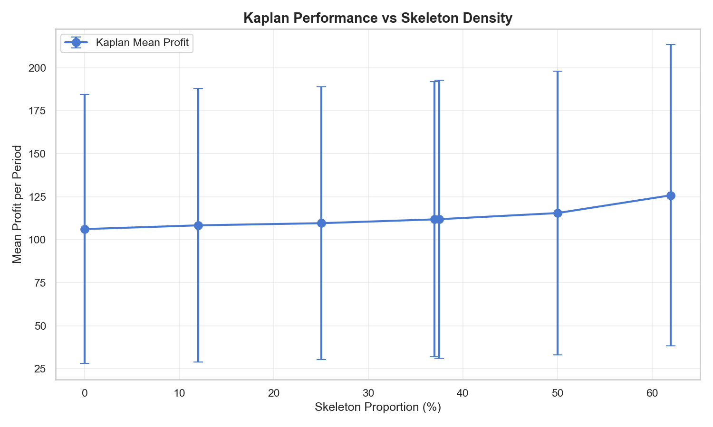
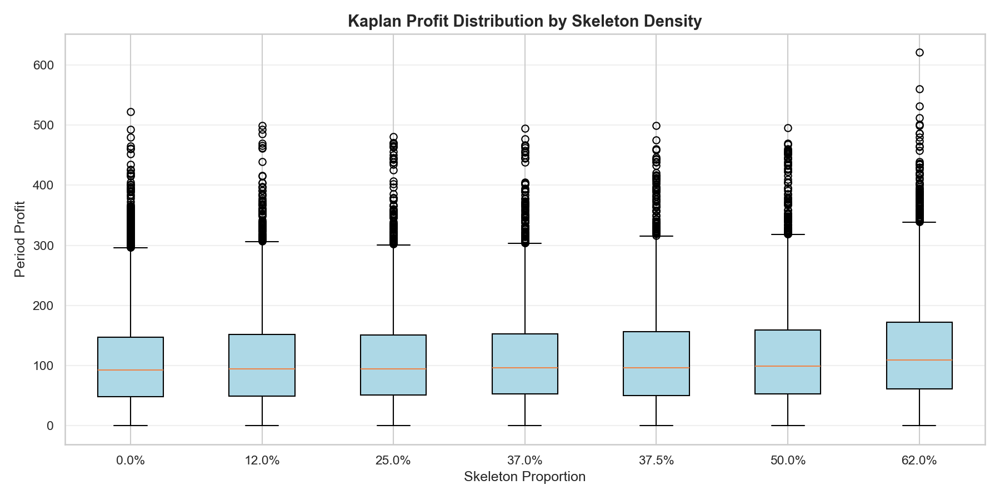
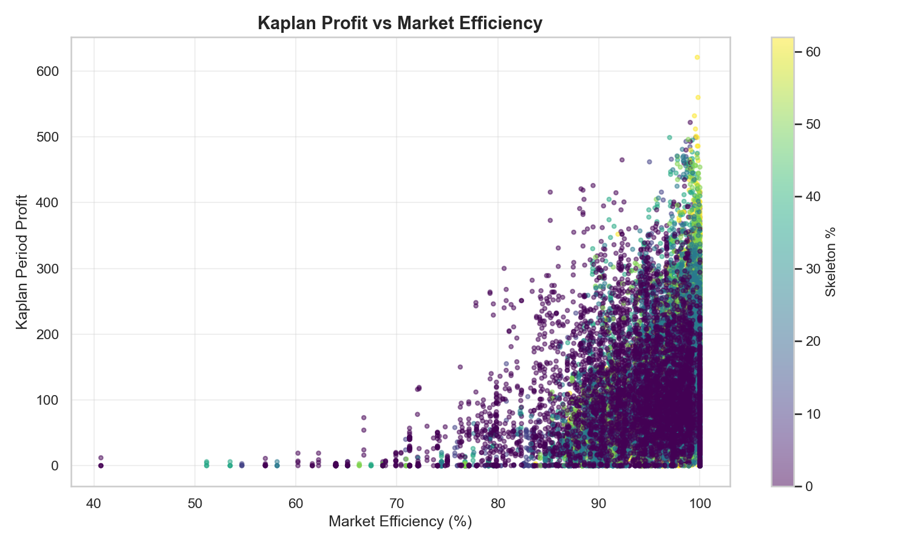
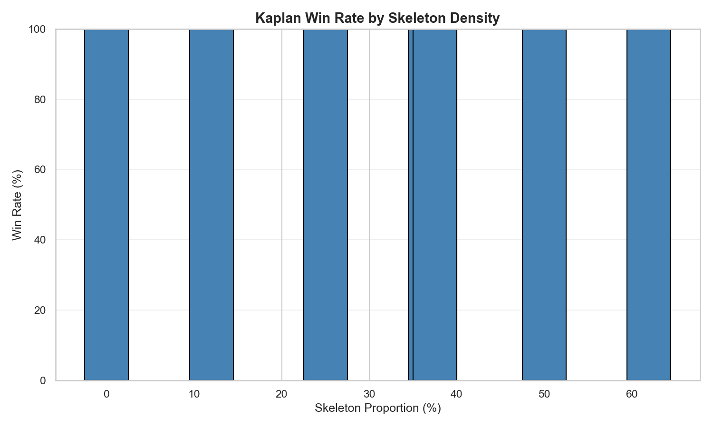

# Kaplan Performance Analysis: Impact of Skeleton Presence

**Generated:** 2025-11-25 14:06:37

---

## Executive Summary

This analysis investigates whether Kaplan's predatory sniping strategy benefits from the presence of Skeleton agents in mixed-strategy double auction tournaments.

### Key Findings

**Baseline Comparison (With vs Without Skeleton):**
- Mean profit WITHOUT Skeleton: 106.20
- Mean profit WITH Skeleton: 113.85
- Difference: 7.66 (7.2%)
- T-statistic: 7.325
- P-value: 0.0000
- Cohen's d: 0.096
- **Statistically Significant:** YES ✓

**ANOVA (Across all Skeleton densities):**
- F-statistic: 29.624
- P-value: 0.0000
- **Statistically Significant:** YES ✓

**Linear Regression (Profit ~ Skeleton %):**
- Slope: 0.2568 (profit change per 1% Skeleton increase)
- R²: 0.0046
- P-value: 0.0000
- **Statistically Significant:** YES ✓

---

## Methodology

**Tournament Structure:**
- 8 buyers × 8 sellers (16 total agents)
- 100 rounds × 10 periods = 1,000 market instances per configuration
- 100 steps per period
- Game 6453 token generation (Santa Fe standard)

**Treatments:**
- Control: 0% Skeleton (Kaplan vs ZIC/ZIP/GD only)
- Varying Skeleton density: 12.5%, 25%, 37.5%, 50%, 62.5%
- Kaplan held constant at 25% (2/8 agents) across all treatments

---

## Results by Skeleton Density

| Skeleton % | Mean Profit | Std Dev | Win Rate % | Mean Efficiency % | Observations |
|------------|-------------|---------|------------|-------------------|-------------|
| 0.0% | 106.20 | 78.17 | 110.0% | 93.80% | 8000 |
| 12.0% | 108.37 | 79.51 | 105.1% | 96.49% | 4000 |
| 25.0% | 109.62 | 79.22 | 105.3% | 96.66% | 4000 |
| 37.0% | 111.84 | 79.99 | 105.5% | 97.12% | 4000 |
| 37.5% | 111.94 | 80.78 | 104.3% | 97.03% | 4000 |
| 50.0% | 115.50 | 82.60 | 105.2% | 97.33% | 4000 |
| 62.0% | 125.84 | 87.55 | 104.1% | 98.81% | 4000 |

---

## Visualizations

---

## Discussion

### Mechanism

Kaplan's sniping strategy exploits Skeleton's predictable alpha-weighted convergence:
1. Skeleton agents narrow the spread through adaptive weighted-average bidding
2. Kaplan waits at extreme prices (bid=1 or ask=999)
3. Kaplan snipes trades at favorable prices after spread narrows
4. Visual test evidence: Kaplan achieves 2.2x profit advantage in pure Kaplan vs Skeleton matchups

### Implications

**For Kaplan:**
- Skeleton presence increases exploitable patterns in the market
- Kaplan's timing-based advantage allows surplus extraction even in efficient markets

**For Market Design:**
- High efficiency does not guarantee equitable surplus distribution
- Patient strategic agents can dominate adaptive but predictable opponents

---

## Recommendations

1. **Against Kaplan:** Avoid predictable convergence patterns; use randomization or time-varying strategies
2. **With Kaplan:** Optimal opponent mix depends on analysis results (see metrics table above)
3. **For RL Training:** Use Kaplan as adversary to learn robust non-exploitable policies

---

*Generated by: scripts/analyze_kaplan_skeleton_impact.py*
